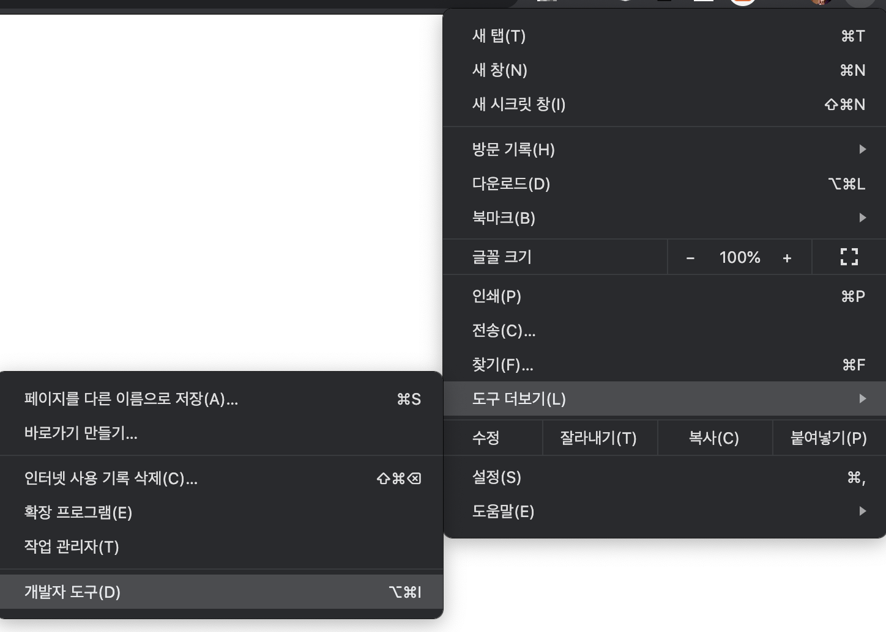

2020 . 08 . 08 handler & Sorry
=
이번 내용은 프로젝트함에 있어서 주 가지인 내용이 아닌 Plus 내용에 대한 소개 입니다.  
서비스를 할때 에러가 났을때 기본 페이지가 아닌 커스텀 페이지를 보여주는 방법과 어떤 페이지를 접근할때 특정한 조건에 맞을 경우 다른 페이지를 보여주는 기능입니다.  
먼저 커스텀 에러 페이지에 대해서 알아보겠습니다. 
## 404 handler

보통 어떤 서비스를 사용할때 존재하지 않는 페이지로 접근할때 404 error 가 나옵니다.  
대표적으로 네이버나 구글의 홈에서 url에 아무거나 넣고 enter를 치면 나오는 화면은 아래와 같고 이러한 페이지를 만드는 방법입니다. 


## mysite/urls
프로젝트 urls 파일에 아래 코드들을 추가해줍니다.  
여기서는 이전에 언급했던 다중 App 사용을 직접 활용하기위해 새로운 App을 만들어서 작성하였습니다.  
``` python
# mysite/urls.py
from django.conf.urls import handler404
import handlerpage.views

handler404 = 'handlerpage.views.handler404'

```

새로운 App을 생성한다. 
``` bash
(myclass) $ python manage.py startapp handlerpage
```

## handlerpage/views
새로만든 app의 view에서 작업합니다. 아래의 코드를 작성해주세요
``` python
# handerpage/views.py 
from django.views.defaults import page_not_found

def handler404(request, exception):
    return page_not_found(request, exception, template_name="404.html")

```

view까지 작성하였으니 이를 통해서 보여줄 404 페이지를 템플릿폴더안에 생성하여서 직접 만들어줍니다. 

## handler/templates/404
``` html
<!-- handlerpage/templates/404.html
! + tab , h1 + tab + 텍스트 작성 --> 
```


이제 서버를 실행하여서 정상 작동하는지 살펴봅니다. 
``` bash
# 서버 시작
(myclass) $ python manage.py runserver
```
먼저 index page를 확인해보면 정상적으로 나오는것을 확인할 수 있습니다.  
이제 url 뒤에 아무거나 추가하고 enter를 눌러보세요.  
아마 우리가 만든 페이지가 아닌 아래와 같은 페이지가 나오는것을 확인할 수 있습니다. 

이렇게 나오는 이유는 해당 페이지의 영어들을 살펴보면 알수 있는데 친절하게 맨 아래쪽에 'You're seeing this error because you have DEBUG = True in your Django settings file. Change that to False, and Django will display a standard 404 page.' 라고 나와있는것을 확인할 수 있습니다.  
영어를 해석해보면 '이 페이지가 나오는 이유는 setting 에서 DEBUG 라는 값이 TRUE 이기 때문이고 이를 False 로 바꾸면 장고의 standard 404 page 를 볼수 있다.' 로 간단하게 해석할 수 있습니다.  
그렇다면 해당 설명과 추가적인 세팅을 변경해주도록 하겠습니다. 

## mysite/settings
프로젝트의 settings.py 파일로 들어와서 아래와 같이 해당부분을 수정해주세요
```
## 해당 값을 매번 지웠다 쓰는 귀찮음을 대신해서 False 를 한줄을 추가한 후 해당 값들을 바꾸어야 할때 주석의 위치를 위/아래로 바꾸어서 해주면 해당 값을 쉽게 바꿀수 있습니다. 
# DEBUG = True
DEBUG = False

ALLOWED_HOSTS = ['*']


# Application definition

INSTALLED_APPS = [
    # 이전 수업을 잘 기억하고 있다면 handlerpage App을 만들었을때 해당 값을 미리 추가해주었다면 아주 잘하셨습니다 !!
    'handlerpage',
```


위의 사진/코드와 같이 수정하였다면 다시 켜져있는 페이지로 돌아와서 새로고침을 하면 우리가 작성해주었던 404 페이지를 볼수 있습니다. 


이제 다음으로 어떤 페이지를 접근할때 특정한 조건에 맞을 경우 다른 페이지를 보여주는 기능에 대한 기능입니다.   
여기서 말하는 특정한 조건에는 여러가지가 있을 수 있고 해당 강의에서는 간단한 예시인 Device의 가로 길이가 특정 미만일경우 mobile 로 간주하고, sorry 페이지로 강제 이동하는 기능을 구현해보겠습니다.  
먼저 해당 기능이 작동하는 페이지를 이미 만들어 두었던 blog App의 index.html 페이지를 기준으로 만들어보겠습니다.  

## blog/view & blog/urls
먼저 강제로 보여줄 sorry.html 에 대한 view&urls 코드를 작성해보겠습니다. 

## blog/views
``` python
# blog/views.py 에 해 당 코드를 추가해주세요
def sorry(request):
	return render(request, 'sorry.html')
```

## blog/urls
``` python
# blog/urls.py 에 해당 코드를 추가해주세요
	path('sorry', views.sorry, name='sorry'),
```


## sorry.html
sorry.html 파일을 blog 앱의 템플릿에 추가해주세요
``` html
<!-- sorry.html 파일 추가 
! + tab , h1 + tab + 텍스트 작성 --> 
```


## index.html
index.html 의 최상단부에 해당 코드를 작성해주세요
``` html
<!-- 파일 상단부에 JS 코드 추가 -->
<script type="text/javascript">
    if (screen.width <= 699) {
    document.location.href = "sorry";
    }
</script>
```
해당코드는 Javascript 코드로 간단하게 설명하면 가로 699 미만일경우 sorry 페이지로 이동하여라 라는 코드입니다.  
JS를 배우지 않은 지금은 이해보다는 이러한 기능이 있음을 알고 해당 기능을 활용하면 어떤 기능 까지 구현할 수 있을지 생각해보면 좋을것 같습니다. 


이러한 기능의 테스트는 크롬의 개발자 도구를 활용하여서 확인할 수 있습니다.  
  
개발자 도구에서 왼쪽 상단의 두번째의 'Toggle device toolbar'(Elements 왼쪽 버튼)를 선택하면 기본 뷰가 변경됩니다.  
  
'Responsive'로 되어있고 해당표시옆의 숫자를 수정하여서 보이는 크기를 수정할수 있습니다.  
  
 이중 첫번째 숫자(가로)를 코드에서 설정한 699이하로 설정하고 새로고침할 경우 페이지가 강제로 이동합니다.  
 