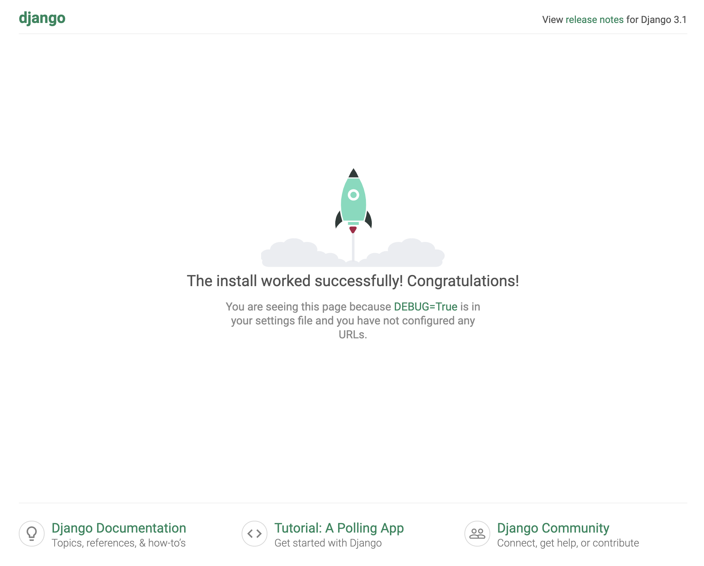
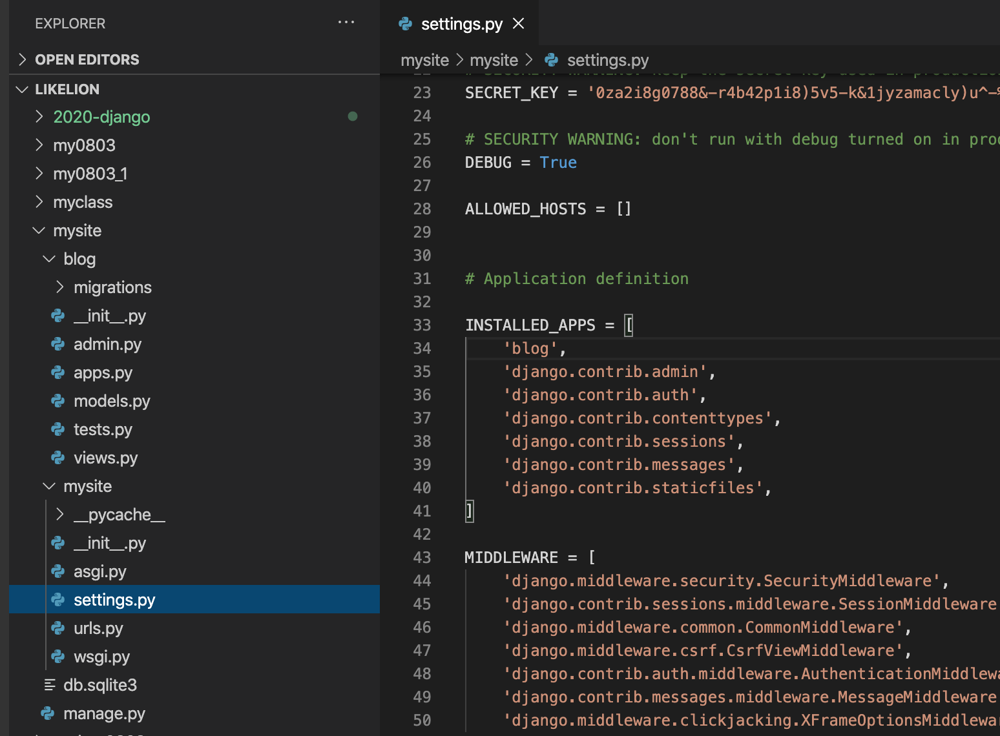
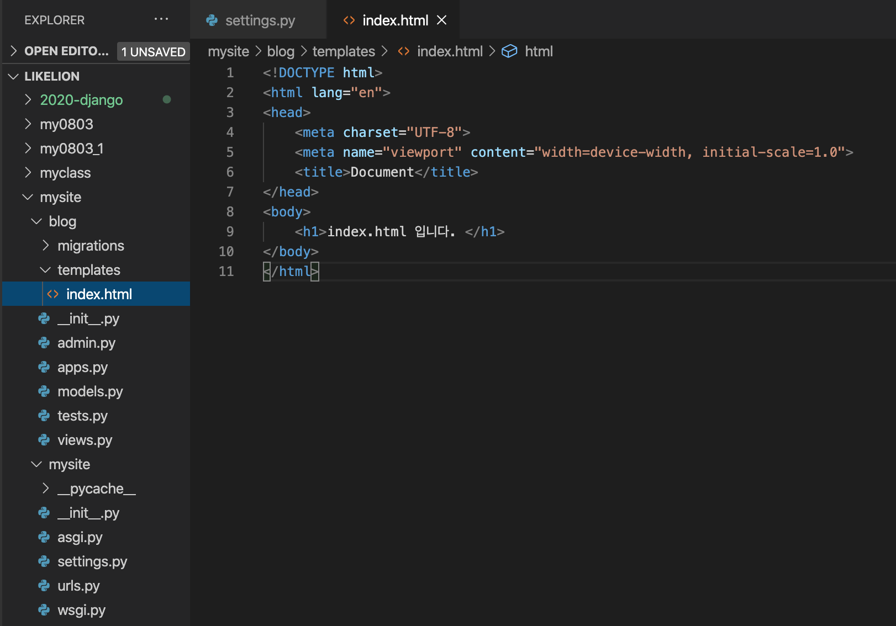
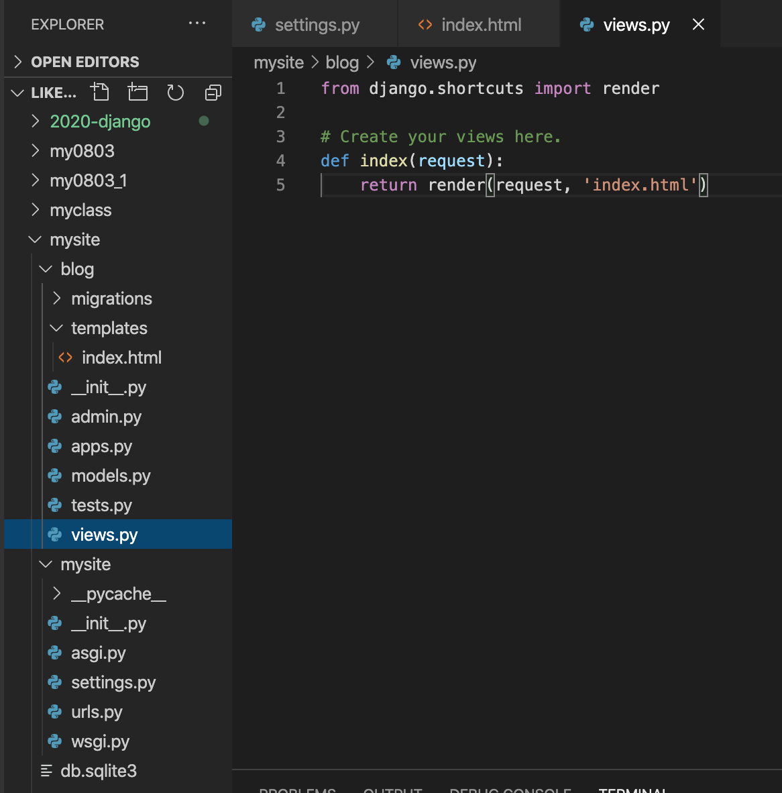
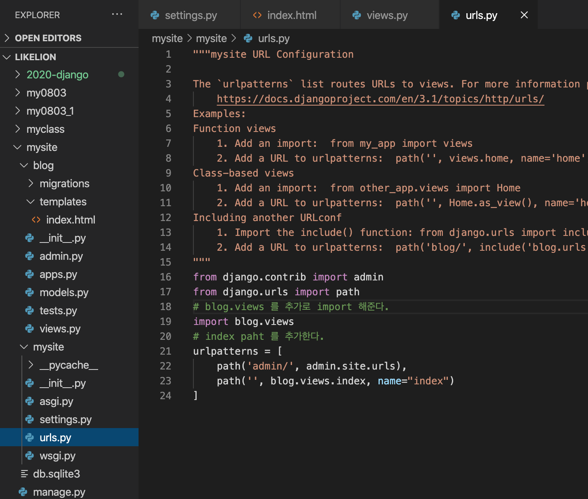
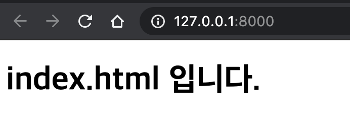

2020 . 08 . 08 speed reivew
=

가상환경 생성부터 다시작합니다.  
이전 시간에 한번 했던 내용이므로 App 생성후 간단한 index 화면을 띄우는것까지 빠르게 진행합니다. 

(강의자 개발환경 Mac OS - vscode)
``` bash
# myclass 라는 이름의 가상환경 생성
$ python3 -m venv myclass

# 가상환경 활성화
$ source myclass/bin/activate

# 가상환경에 django 설치(install)
(myclass) $ pip install django
...
Installing collected packages: sqlparse, asgiref, pytz, django
Successfully installed asgiref-3.2.10 django-3.1 pytz-2020.1 sqlparse-0.3.1 # 해당 메시지 출력시 설치 완료

# 장고 프로젝스 생성
(myclass) $ django-admin startproject mysite

# 프로젝트 내부로 디렉토리 이동
(myclass) $ cd mysite

# 장고 프로젝트 정상 생성을 runserver로 확인해봅니다. 
(myclass) $ python manage.py runserver
Django version 3.1, using settings 'mysite.settings'
Starting development server at http://127.0.0.1:8000/ # 해당 url을 ctrl + 클릭으로 접속가능
Quit the server with CONTROL-C.
```
##  django default 화면이 나오는것을 확인


이어서 프로젝트를 진행함
```
# App 생성
(myclass) $ python manage.py startapp blog
```
## settings 파일 수정
mysite/settings.py 로 이동 후 INSTALLED_APP 에 'blog', 추가


## blog 에 index.html 을 생성
blog 폴데 내부에 templates 폴더를 생성하고 해당 폴더 내부에 index.html 파일을 생성 하고 내부 내용을 간단히 채워준다.   
! + tab 으로 html 뼈대를 간단히 생성  
body 태그 안쪽에서 h1 + tab 으로 태그 생성후 간단한 내용을 채워준다. 


## blog/views 작성
``` python
# blog/views.py 파일에 해당 코드를 추가
def index(request):
    return render(request, 'index.html')
```


## mysite/urls 작성
``` python 
# blog.views 를 추가로 import 해준다. 
import blog.views
# index path 를 추가한다. 
urlpatterns = [
    path('admin/', admin.site.urls),
    path('', blog.views.index, name="index")
]
```


서버를 실행시켜서 정상적으로 작동하는지 확인한다. 
```
(mysite) $ python manage.py runserver
```
화면과 같이 나온다면 성공  

