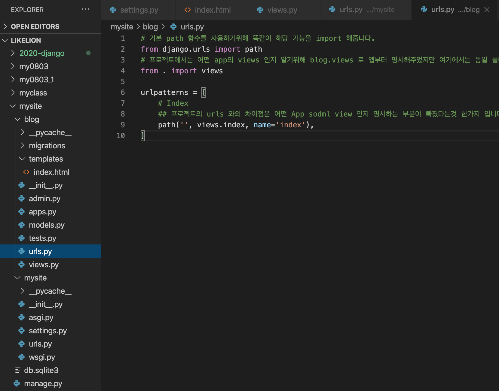
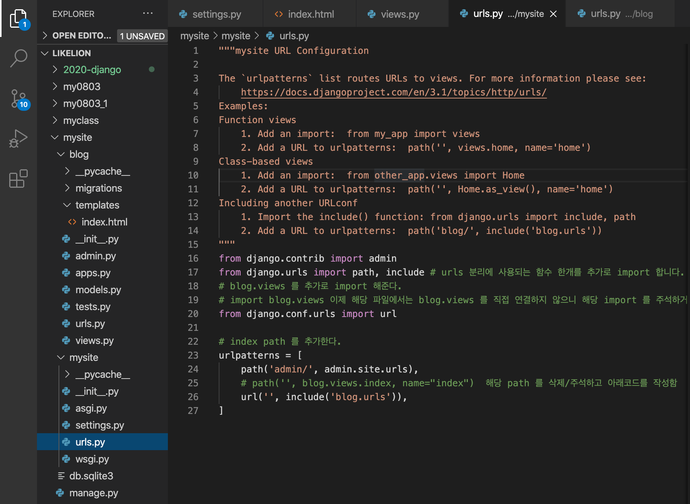

2020 . 08 . 08 urls
=

기능과 페이지가 많아지기 시작한다면 url 을 관리할때 어떨까요?  
mysite/urls.py 에 path 가 점점 많아지게 되고 한눈에 보기 힘들어집니다.  
따라서 이를 App 별로 새로운 urls.py 를 만들어서 관리해줍니다.  
그렇게 되면 해당 App 에 맞게 분리하여 url을 관리할 수 있게 되고, 추가/수정하는데 수월해집니다.  
이번에는 해당 기능을 구현해보겠습니다. 

해당 작업들은 가상환경이 켜져있는것을 전제로 진행합니다.  

## blog/urls
먼저 Blog App 내부에 urls.py 파일을 만들어 줍니다.  
마우스로도 만들수 있지만 terminal 에서도 간단한 명령어로 만들수 있습니다. 
``` bash
# 먼저 서버가 켜져있다면 crtl + c 로 서버를 꺼주세요
(myclass) $ touch blog/urls.py # OS에 따라 명령어가 다름
```
그리고 파일을 열어서 아래 코드를 작성합니다. 
``` python
# blog/urls.py
# 기본 path 함수를 사용하기위해 똑같이 해당 기능을 import 해줍니다. 
from django.urls import path
# 프로젝트에서는 어떤 app의 views 인지 알기위해 blog.views 로 앱부터 명시했지만 여기에서는 동일 폴더내에 있는 views 라는것을 명시하기위해 form .(현재폴더) import views 로 사용했습니다. 
from . import views

urlpatterns = [
	# Index
    ## 프로젝트의 urls 와의 차이점은 어떤 App 내의 view 인지 명시하는 부분이 빠졌다는것 한가지 입니다. 
    path('', views.index, name='index'),
]
```


그리고 프로젝트 urls 를 정리해줍니다. 

## mysite/urls
``` python
# mysite/urls.py
from django.contrib import admin
from django.urls import path, include # urls 분리에 사용되는 함수 한개를 추가로 import 합니다. 
# blog.views 를 추가로 import 해준다. 
# import blog.views 이제 해당 파일에서는 blog.views 를 직접 연결하지 않으니 해당 import 를 주석하거나 삭제합니다. 
from django.conf.urls import url

# index path 를 추가한다. 
urlpatterns = [
    path('admin/', admin.site.urls),
    # path('', blog.views.index, name="index")  해당 path 를 삭제/주석하고 아래코드를 작성함
    url('', include('blog.urls')),
]
```


이렇게 코드들을 변경하고 서버를 재 실행하면 페이지가 정상적으로 작동합니다.  
