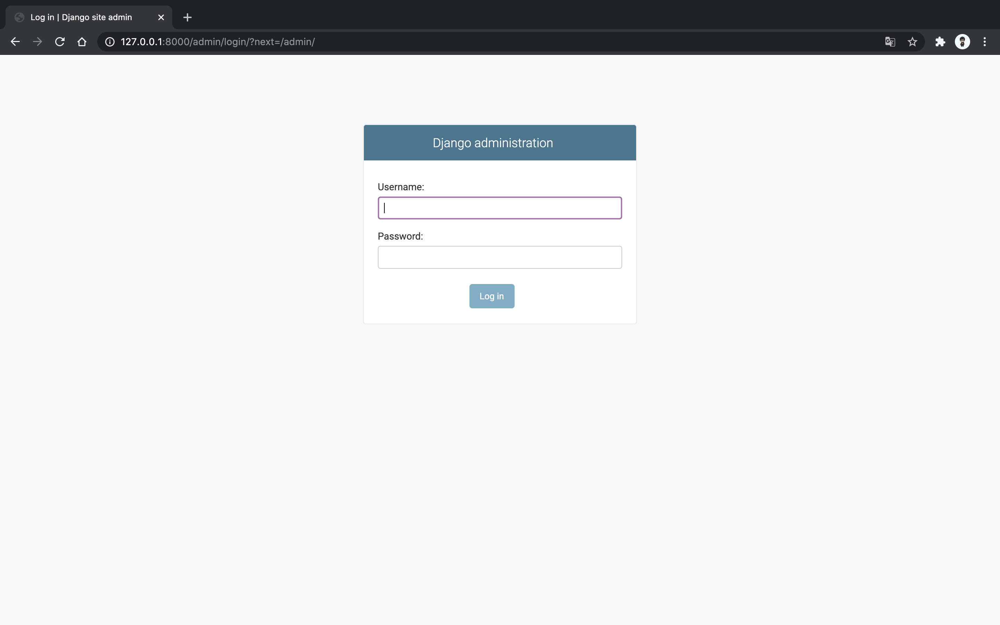
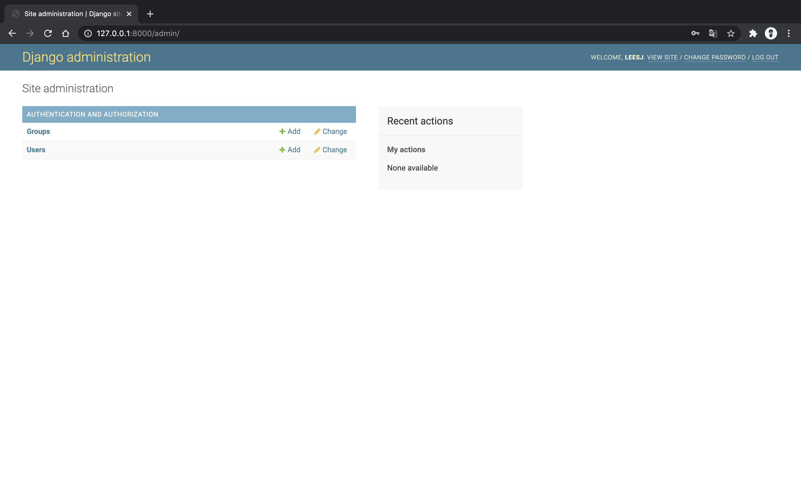
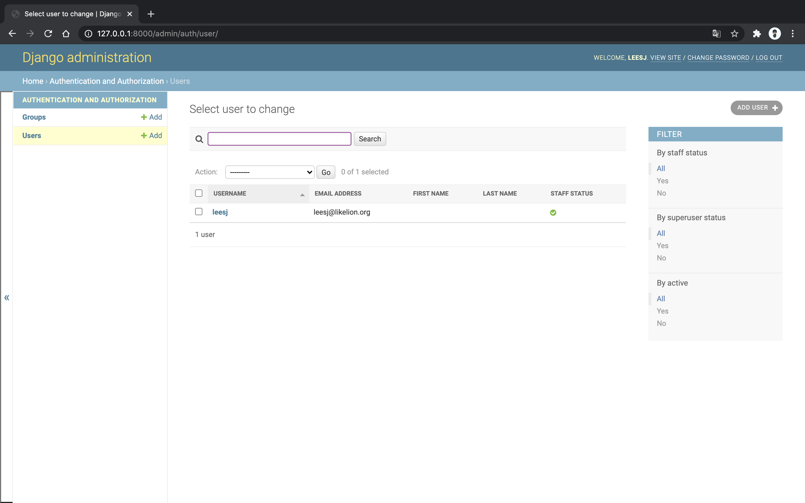
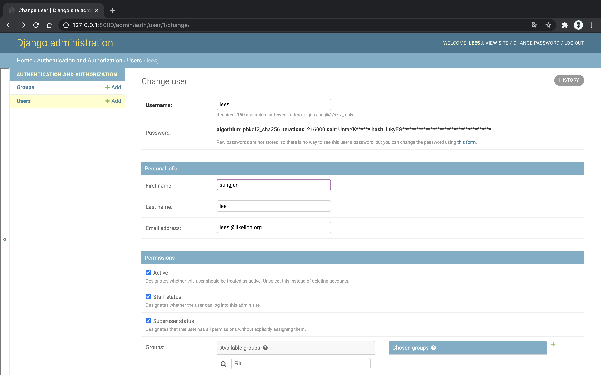
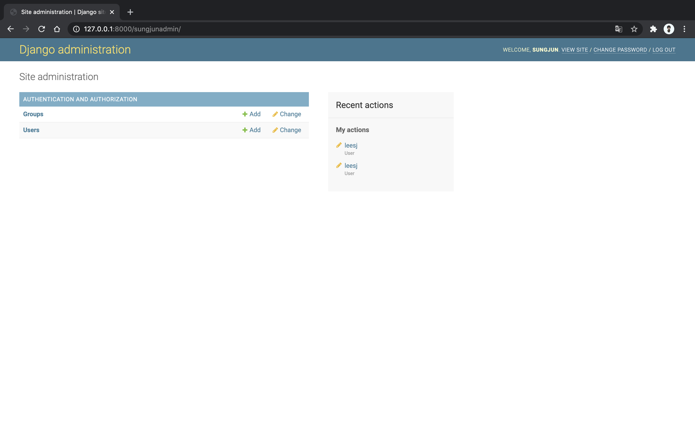

2020 . 08 . 11 admin
=

이번에는 django 의 강력한 admin 을 사용해보겠습니다.  
08/11 speed review 의 프로젝트로 이어서 진행합니다. 
``` bash
# 모델의 내용을 DB에 적용하는 명령어 입니다. 
(sungjun) $ python manage.py migrate

# 관리자 계정을 생성합니다. 
(sungjun) $ python manage.py createsuperuser
Username (leave blank to use 'leesj'):   # username을 설정합니다. enter를 입력하거나 원하는 username을 설정해주세요
Email address: leesj@likelion.org        # 본인이메일을 작성하거나 아무 이메일을 작성해주세요.
Password:                                # 비밀번호를 입력해주세요 아무것도 안나오지만 입력이 정상적으로 되는 중입니다. 
Password (again):                        # 오타가 있을 경우 backspace 를 많~~~이 눌러서 지운후 다시 써주세요
This password is too short. It must contain at least 8 characters.
This password is too common.
Bypass password validation and create user anyway? [y/N]: y   
Superuser created successfully.          # 비밀번호를 8자 이상 입력하면 위의 3개의 메세지는 나오지 않고 해당 메세지가 나옵니다.

# 서버 실행
(sungjun) $ python manage.py runserver
```

이제 기본 페이지로 들어간 후 url의 뒤에 `/admin` 을 입력후 enter  
admin 페이지로 들어갈수 있습니다.  
여기에 본인이 방금 만들었던 username / password 를 입력하여서 로그인하세요


어드민 페이지에 들어왔습니다. 왼쪽의 Groups / Users 중 Users 를 클릭  


가운데에 현재 있는 user의 정보를 확인할수 있고, 오른쪽에서 filter 기능을 활용할수 있고, 그 위에서 새로운 유저를 생성할수도 있습니다  
가운데 있는 username 을 클릭하여서 상세 정보 페이지로 들어가보세요


유저의 거의 모든 정보들을 확인할 수 있고, 아래로 내려보면 권한을 수정할수도 있고, 로그인한 시간대도 확인할수 있습니다  
한번 first name 과 last name 을 추가하고 페이지 최하단부에서 save and continue editing를 선택해보세요  
그리고 우측 상단 history 를 확인하면 변경내역도 확인 가능합니다.  


여기서 추가로 /admin url 을 바꾸고 싶다면 어떻게 하면 될까요?  
어떻게 하면 될지 생각해보거나 직접 바꿔보고 아래 링크를 클릭해 정답을 확인해보세요  
[정답!](image/0811/08.png)

그러면 이와 같이 바뀐 url 로 어드민 페이지에 접속할수 있습니다   


django 는 이렇게 아주 강력한 admin 페이지를 가지고 있습니다  
본인이 만든 모델들도 admin 페이지에 추가하여서 관리할 수 있습니다  
직접 admin 페이지를 살펴보세요 