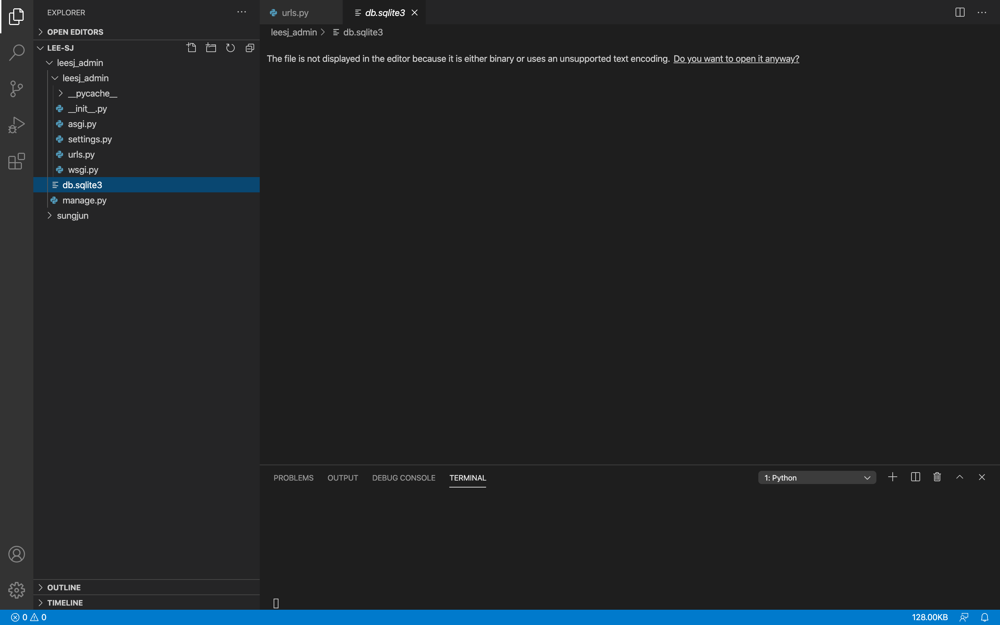

2020 . 08 . 11 db
=

앞서 admin 페이지를 사용해보았습니다.  
그렇다면 database(db)를 사용했다는 것인데 db가 무엇이고 어떻게 사용하고 어떤것들이 있는지 간단하게 알아보겠습니다.   

우선 데이터베이스란 무엇일까요? 
> 위키백과 [데이터베이스](https://ko.wikipedia.org/wiki/%EB%8D%B0%EC%9D%B4%ED%84%B0%EB%B2%A0%EC%9D%B4%EC%8A%A4)   
데이터베이스(영어: database, DB)는 여러 사람이 공유하여 사용할 목적으로 체계화해 통합, 관리하는 데이터의 집합이다.[1] 작성된 목록으로써 여러 응용 시스템들의 통합된 정보들을 저장하여 운영할 수 있는 공용 데이터들의 묶음이다.

뭐라고 하는지 ... 잘 몰라도 무관합니다. 우리는 데이터베이스를 배우는 전공자가 아니니까요  
간단하게 설명하면 '웹 개발을 할때 서비스 상에서 추가/저장/수정/삭제 등의 작업이 필요한 여러가지 형태(image, text, audio, video...)의 정보를 관리하기위해 사용하는 것' 정도로 이해하면 됩니다. 
그렇다면 django 는 그중에서도 어떠한 db 를 사용할까요?  
``` python
# leesj_admin/settings.py 로 이동하여 대략 75번째 줄을 보면 알수 있습니다. 

# Database
# https://docs.djangoproject.com/en/3.1/ref/settings/#databases

DATABASES = {
    'default': {
        'ENGINE': 'django.db.backends.sqlite3',
        'NAME': BASE_DIR / 'db.sqlite3',
    }
}
```
django는 `sqlite3`라는 데이터베이스를 사용합니다.  
> 위키백과 [SQlite](https://ko.wikipedia.org/wiki/SQLite)  
>SQLite는 MySQL나 PostgreSQL와 같은 데이터베이스 관리 시스템이지만, 서버가 아니라 응용 프로그램에 넣어 사용하는 비교적 가벼운 데이터베이스이다. 영어권에서는 '에스큐엘라이트(ˌɛskjuːɛlˈlaɪt)'[3]또는 '시퀄라이트(ˈsiːkwəl.laɪt)'[4]라고 읽는다.  
>
>일반적인 RDBMS에 비해 대규모 작업에는 적합하지 않지만, 중소 규모라면 속도에 손색이 없다. 또 API는 단순히 라이브러리를 호출하는 것만 있으며, 데이터를 저장하는 데 하나의 파일만을 사용하는 것이 특징이다. 버전 3.3.8에서는 풀텍스트 검색 기능을 가진 FTS1 모듈이 지원된다. 컬럼을 삭제하거나 변경하는 것 등이 제한된다.  
>
>구글 안드로이드 운영 체제에 기본 탑재된 데이터베이스이기도 하다.

설명에서 확인할수 있듯이 작은 프로젝트 내에서는 sqlite 를 사용하기도 하지만 더 복잡하거나, 많은 데이터를 사용하거나, 사용자가 많다면 다른 고성능의 데이터 베이스를 사용해야 합니다.  

프로젝트 파일을 확인하면 db.sqlite3 라는 파일이 있는것을 알수 있고 이렇게 프로젝트 내부에서 db를 관리합니다.  
  

프로젝트가 커지고 db에서 민감한 정보들을 관리하기 시작한다면 보안을 제공하는 외부의 서비스들을 사용해서 정보들을 분리해서 관리하여야 합니다.  
우리는 앞으로 aws 서비스를 활용하게 되고, [aws rds](https://aws.amazon.com/ko/rds/) 이러한 서비스들이 있습니다.  

db를 이론적으로 지금부터 모든것을 알아야 하는것이 아니니 앞으로 프로젝트를 진행하면 필요에 의해서 저절로 혹은 직접 배우는 시간이 옵니다.  
그때 db 에 대해서 공부하면 됩니다.  

여기까지 간단하게 db가 무엇인지 살펴보았습니다. 