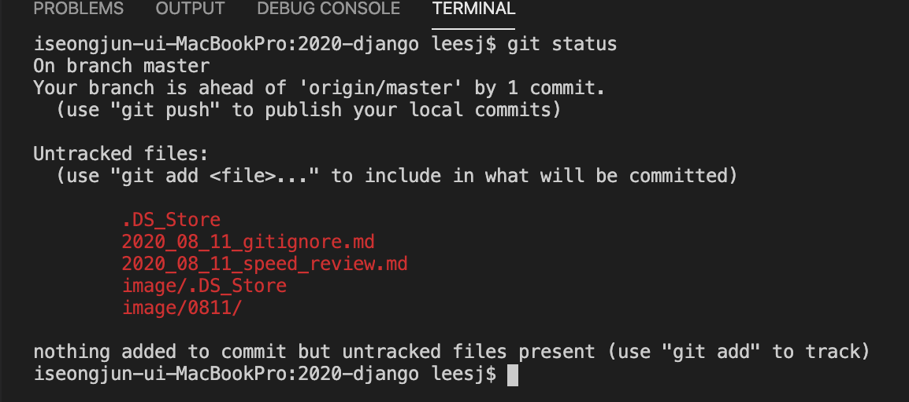
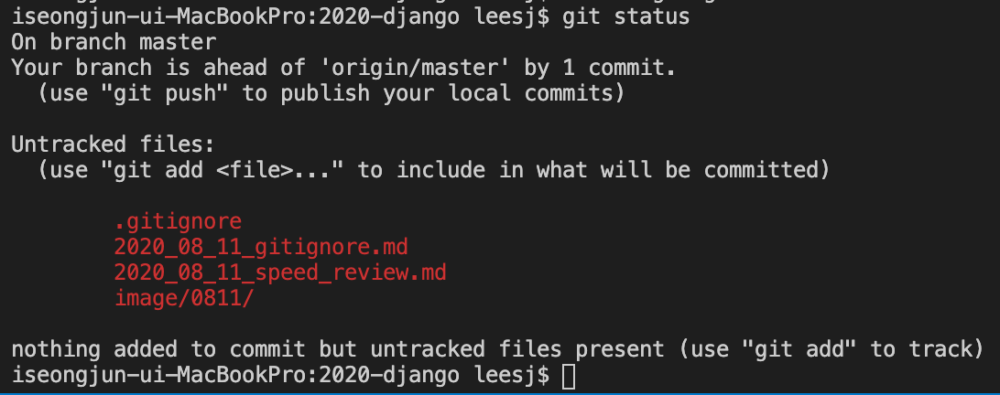

2020 .08 . 11 gitignore
=

vscode(본인의 IDE 혹은 개발환경에 따라서)에서 git 작업을 할때 본인이 추가하거나 작업하지 않은 파일들이 자동으로 추가될때가 있습니다.  
해당 파일들을 git 으로 버전관리를 하고싶지 않을대 유용한 방법으로 .gitignore 파일을 생성하여서 관리하는것입니다.  
.gitignore에 추가한 파일/폴더는 무시하고 작업할수 있습니다.  

``` bash
$ git status
```
아래의 사진과 같이 .DB_Store 라는 파일이 git에서 무시하고자 한다면 아래와 같이 하면 됩니다.  


``` bash
# .gitignore 파일 생성
$ touch .gitignore
```
.gitignore 파일을 생성하고 해당 파일이름을 추가한후 다시 확인해보세요
```
# .gitignore 파일입니다. 
.DS_Store
```
그러면 이와같이 .gitignore 파일이 추가되었고 두개의 DS_Store가 사라진것을 확인할수 있습니다. 
