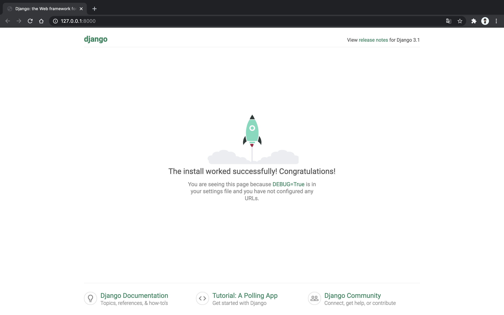

2020 . 08. 11 speed review
=

빠르게 장고 프로젝트 생성부터 다시 시작  
반복이 중요하니 장고를 처음배우는 지금 단계에서 해당 과정을 많이 반복하세요  
``` bash
# 가상환경 생성
$ python3 -m venv sungjun

# 가상환경 실행
$ source sungjun/bin/activate

# 가상환경에 django 설치
(sungjun) $ pip install django

# django project 생성
(sungjun) $ django-admin startproject leesj_admin

# terminal 위치 이동
(sungjun) $ cd leesj_admin

# 프로젝트 작동 확인
(sungjun) $ python manage.py runserver
```
django default 화면 확인
