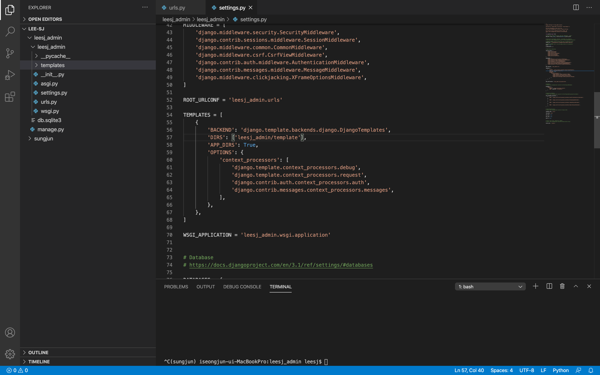
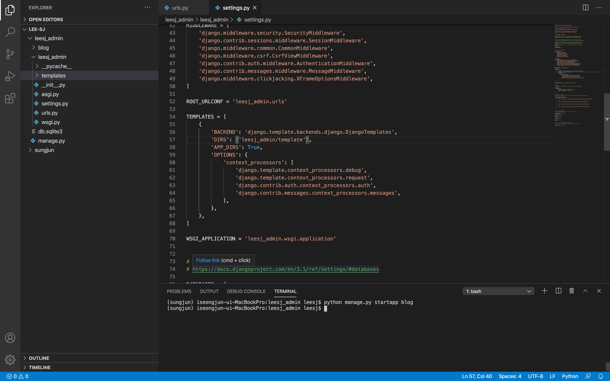
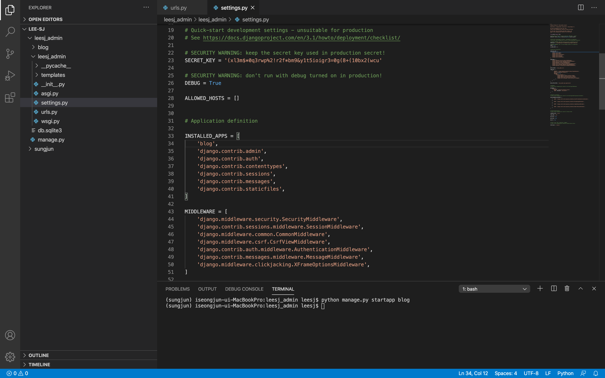
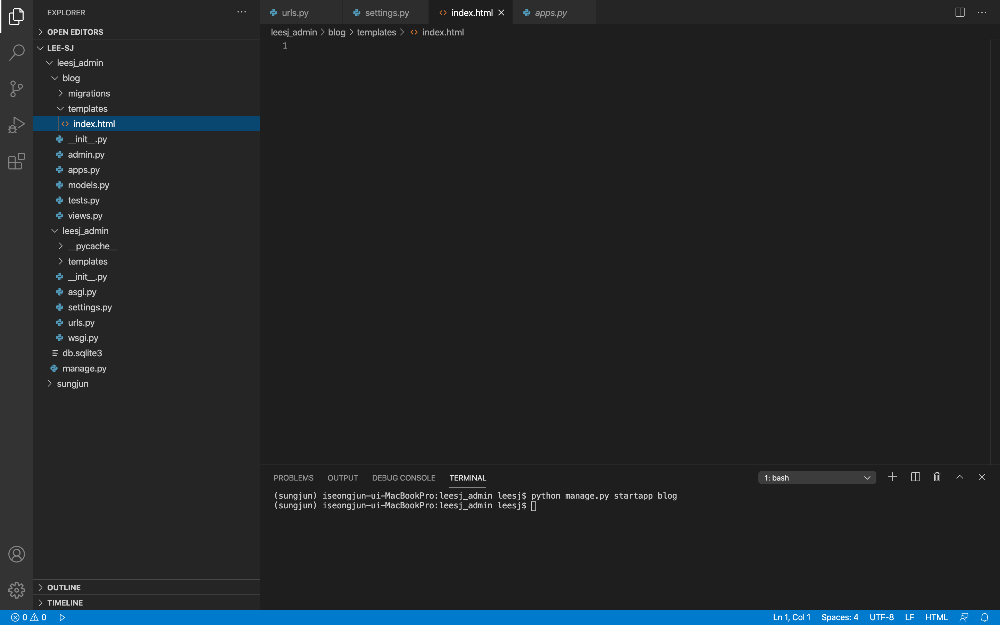
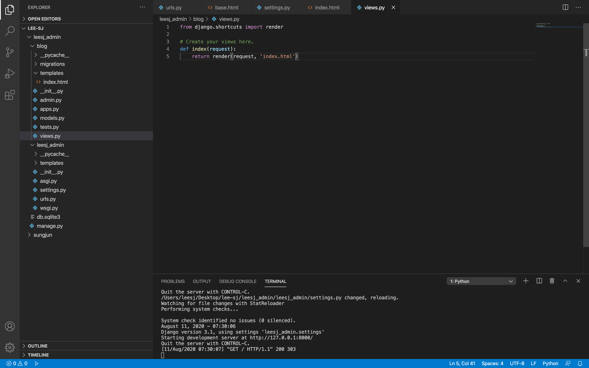
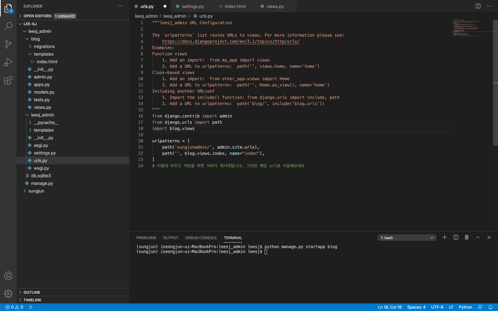
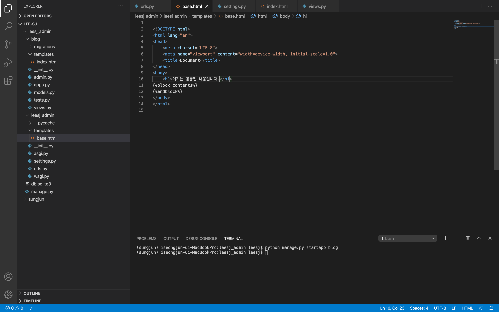
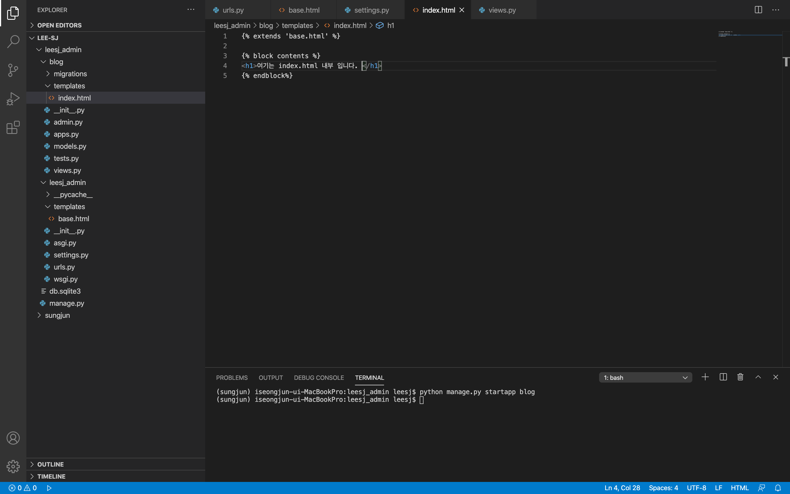
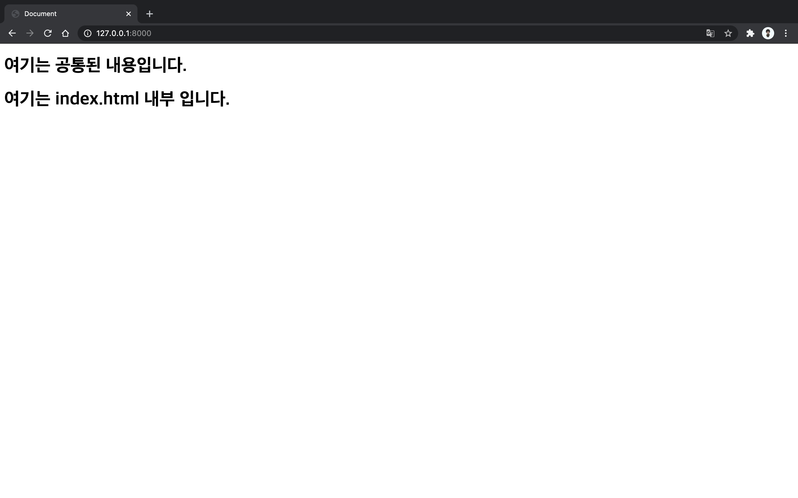

2020 . 08 .11 템플릿 상속
=

웹서비스를 사용하다 보면, 각 페이지마다 공통적으로 존재하는 요소들이 있습니다  
예를 들면 페이지 상단에 위치한 메뉴바가 대표적이고, 이러한 공통적인 요소들을 각 페이지의 html 파일마다 똑같이 적어주면, 굉장히 비효율적이고 이럴때 사용할 수 있는 것이 바로 템플릿 상속입니다.

템플릿 상속을 쉽게 설명해 보자면, 공통된 요소들을 한 html파일에 모두 담아두고, 각 페이지에 필요할 때마다 불러와서 쓰는 방법이라고 생각하면 될 것 같습니다.  

settings 로 가서 templates 로 사용할 templetes 폴더를 지정해주어야 합니다.  
우선 프로젝트 폴더에 templates 라는 폴더를 만들어 주었고, 코드의 `'DIRS' : [ ]` 안에 `'leesj_admin/templates'` 를 넣어주었습니다.  
(사진의 template는 오타입니다. templates 로 이후 수정함)  


그리고 빠르게 App 만들어서 templates 를 활용해보겠습니다. 
``` bash
# blog app 생성
(sungjun) $ python manage.py startapp blog
```


## leesj_admin/settings.py INSTALLED_APP 에 'blog', 추가  


## blog app 내부에 tmeplates 폴더 생성후 index.html 파일 생성


## blog/views.py 작성
``` python
def index(request):
    return render(request, 'index.html')
```  


## leesj_admin/urls.py 작성
``` python
# blog.views 를 추가로 import 해준다. 
import blog.views
# index path 를 추가한다. 
urlpatterns = [
    path('sungjunadmin/', admin.site.urls),
    path('', blog.views.index, name="index")
]
```  


## leesj_admin/templatels/base.html 생성 및 작성
index 에서는 body 태그 안의 태그만 작성해고 이외의 html 뼈대와 head 를 base.html 에 작성하였습니다.  
그리고 중간의 block 태그 -  를 통해서 공동된 내용을 뺀 개별 내용들이 들어갈 곳을 명시해줍니다. 
``` html

<!DOCTYPE html>
<html lang="en">
<head>
    <meta charset="UTF-8">
    <meta name="viewport" content="width=device-width, initial-scale=1.0">
    <title>Document</title>
</head>
<body>
    <h1>여기는 공통된 내용입니다.</h1>


</body>
</html>
```

## blog/index.html 작성하기
첫줄은 해당 파일은 base.html 을 불러온다는 뜻이고 base.html에 작성한것처럼 block 태그로 어디에 코드가 위치하는지 알려주고 그 내부에 index.html 코드가 들어올 곳을 명시해줍니다. 
``` html



<h1>여기는 index.html 내부 입니다. </h1>

```


## runserver!
``` bash
(sungjun) $ python manage.py runserver
```
페이지를 확인하면 정상적으로 base.html이 적용된것을 확인할수 있습니다.  
base.html 과 index.html 을 수정해보면서 어떻게 적용되는지 직접알아보고, base.html 을 왜 사용하는지 이해할수 있습니다.  
개발자들은 비효율적이고 반복적인 코드를 싫어합니다.  

이렇게 base.html 을 작성한다면 앞으로 다른 html 파일을 생성해서 페이지를 만들때 매번 html 뼈대 코드를 작성하지 않고, body 안에 있는 코드들만 작성할수 있습니다.  


무조건 이렇게 base.html 을 작성하는것이 아닌 본인의 프로젝트의 구성에 맞게 어떤 코드들이 반복되는지 살펴보고 반복되는 코드들을 base.html 처럼 만들어서 반복을 피해주면 코드가 효율적으로 작동합니다.  

여기까지 templates 으로 만들어서 반복되는 코드를 줄이는 방법에 대해서 알아보았습니다 