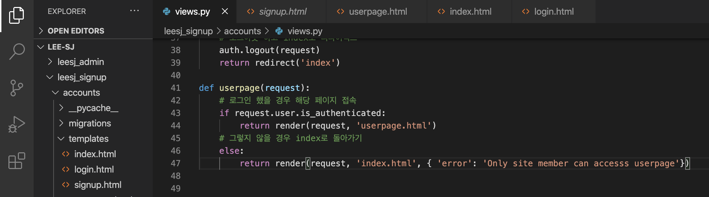

auth
=

마지막으로 간단히 유저에게 간단한 권한을 부여해보겠습니다.  

해당 사이트를 방문하는 게스트를 대상으로 회원일경우와 아닐경우를 구분하여서  
회원만 접근 가능한 페이지를 만들어서 권한을 부여해보겠습니다. 

### 회원전용 페이지 

우선 페이지를 한개 만들어보겠습니다. 간단한 템플릿과 view,url을 코딩해주세요 

``` python
# 각각의 파일에 해당내용을 작성해주세요

# views.py
def userpage(request):
    return render(request, 'userpage.html')

# urls.py
    path('userpage', views.userpage, name='userpage')
```
  
``` html
<!-- userpage.html ! + tab 과 h1 태그로 페이지를 간단히 만듭니다.  -->

```
  

그리고 모든 상태에서 해당 페이지로 접근할수 있게 index에 버튼을 추가합니다. 
``` html
<!-- 조건문 위쪽에 userpage 버튼을 추가합니다.  -->
    <h1>index 입니다. </h1>
    <a class="nav-link" href="">userpage</a>
    <!-- 조건문을 통해서 만약 로그인이 상태라면 로그아웃 버튼을 나타내고 -->
     
 
```
  

### 권한 기능 view 코드 작성

``` python
# views.py
def userpage(request):
    # 로그인 했을 경우 해당 페이지 접속
    if request.user.is_authenticated: 
        return render(request, 'userpage.html')
    # 그렇지 않을 경우 index로 돌아가기
    else:
        return render(request, 'index.html', { 'error': 'Only site member can accesss userpage'})

```

  

위와 같이 코딩하고 userpage 버튼을 클릭하면 아래와 같이 해당 페이지로 들어갈수 없습니다.  

  

로그인 하고 userpage 버튼을 클릭할경우 아래와 같이 정상적으로 해당 페이지에 접근가능합니다.  

  

여기까지 조건문을 통해서 유저에게 간단한 권한을 부여해보았습니다.  

해당 코드는 엄밀한 의미에서의 권한 부여는 아니지만 조건에 따라서 접근할수 있는지 없는지를 구별할수 있어서 간단하게 해당 코드로 권한 부여에 대해서 알아보았습니다.  

이어서 방학 마지막 세션을 끝내고 과제를 확인해주세요  

[homework](https://www.notion.so/11c015eb44344957ba5318e796b8e6a8)