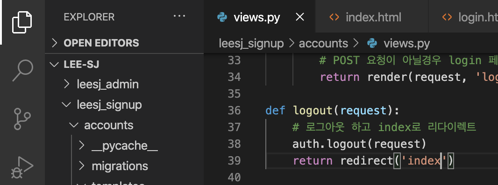

log in & out
=

로그인부터 구현해보겠습니다  

### login templates 코드 작성

``` html
<!-- 회원가입처럼 POST method 를 적용하고, action 을 추가합니다. 그리고 보안코드를 추가합니다. 
 그리고 이번엔 조건문을 통해서 로그인 실패 했을때 error를 나타내는 코드를 추가합니다.  -->
<div class="container" style="padding-top:100px; ">
    
        {{error}}
    
    <h1>Login</h1>
    <form method="POST" action="">
        
        Username:
```


### login view 코드 작성

``` python
# accounts/views.py
from django.contrib import auth

def login(request):
    # POST method 요청이 들어올떄 
    if request.method == 'POST':
        # 입력받은 아이디와 비밀번호가 데이터베이스에 있는지 확인한다. 
        username = request.POST['username']
        password = request.POST['password']
        user = auth.authenticate(request, username=username, password=password)
        # 해당 데이터의 유저가 있다면 
        if user is not None: 
            # 로그인하고 index로 리다이렉트한다. 
            auth.login(request, user)
            return redirect('index')
        else:
            # 없다면, 에러를 표시하고, login페이지 로 이동(새로고침)
            return render(request, 'login.html', {'error': 'username or password is incorrect.'})
    else:
        # POST 요청이 아닐경우 login 페이지 새로고침
        return render(request, 'login.html')
```


여기까지 하였다면 버튼으로 /accounts/login 으로 접속하여서 회원가입을 진행해보세요.   
``` bash
 "GET /accounts/login/ HTTP/1.1" 200 1698
 "POST /accounts/login/ HTTP/1.1" 302 0
 "GET /accounts/ HTTP/1.1" 200 1230
```

이번에도 회원가입과 같이 위처럼 POST 접근 이후 index 로 이동하였다면 정상 작동한것입니다.  
그렇다면 로그아웃기능을 구현하는것 말고 정상작동인것을 알려면 어떻게 해야 할까요 ?  

바로 ...  

바로 ... ... 

...  

index에 로그인 여부로 보이는 상태를 다르게한다면 현재 로그인 상태인지 로그아웃 상태인지를 알수 있는것입니다.  

바로 코딩을 해보면  
``` html
<!-- index.html 입니다.  -->
    <!-- 조건문을 통해서 만약 로그인이 상태라면 로그아웃 버튼을 나타내고 -->
    
        <a class="nav-link" href="">Logout</a>
    <!-- 로그인되어 있지 않으면 기존 버튼 그대로 나타낸다. -->
    
        <a class="nav-link" href="">SignUp</a>
        <a class="nav-link" href="">Login</a>
    
```
  

이제 다시 index를  새로고침해보면 로그인 상태이기 때문에 화면이 아래와 같이 바뀌어있는것을 확인할 수 있습니다.  

  

이렇게 로그인 기능을 구현해보았습니다.  
이어서 로그아웃 기능을 구현해보겠습니다.  

로그아웃 기능은 아~~~~~주 간단합니다.  

### logout view 코드 작성
``` python
# accounts/views.py
def logout(request):
    # 로그아웃 하고 index로 리다이렉트
    auth.logout(request)
    return redirect('index')
```
  

해당 코드를 작성하고 index 에서 logout 버튼을 클릭해보세요.  
  
화면이 위와 같이 회원가입과 로그인할수 있는 버튼이 나오는것을 알수 있습니다.  

이렇게 미리 코드 뼈대를 작성해두어서 view 코드만 추가/수정하여서 간단히 logout 을 구현할 수 있습니다. 

