sign - up
=

우선 오늘의 프로젝트는 기능 구현을 목표로 하고 디자인/프론트 과정없이 진행합니다.  
해당사항과 관련하여 강의 마지막부분에서 관련사항을 확인해주세요.

회원(유저)과 로그인 / 로그아웃의 구현에 대해서 알아본다.  

우선 빠르게 프로젝트를 만들고 시작해본다. 
``` bash

# 가상환경 실행
$ source sungjun/bin/activate

# django project 생성
(sungjun) $ django-admin startproject leesj_signup

# terminal 위치 이동
(sungjun) $ cd leesj_signup

# 프로젝트 작동 확인
(sungjun) $ python manage.py runserver
```

지금까지 여러번 반복한 부분입니다. 이전에 쓰던 프로젝트말고 새로 만들어서 진행해보세요.  

### 우선 회원 기능을 구현할 app 을 만들고 setting 설정
``` bash
(sungjun) $ python manage.py startapp accounts
```
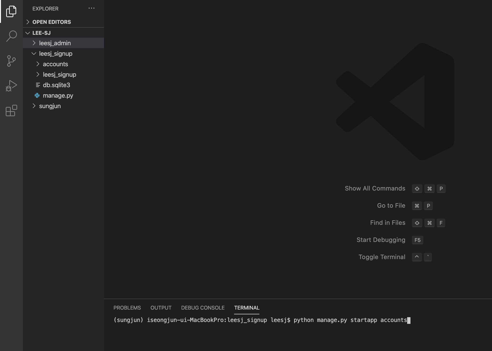  
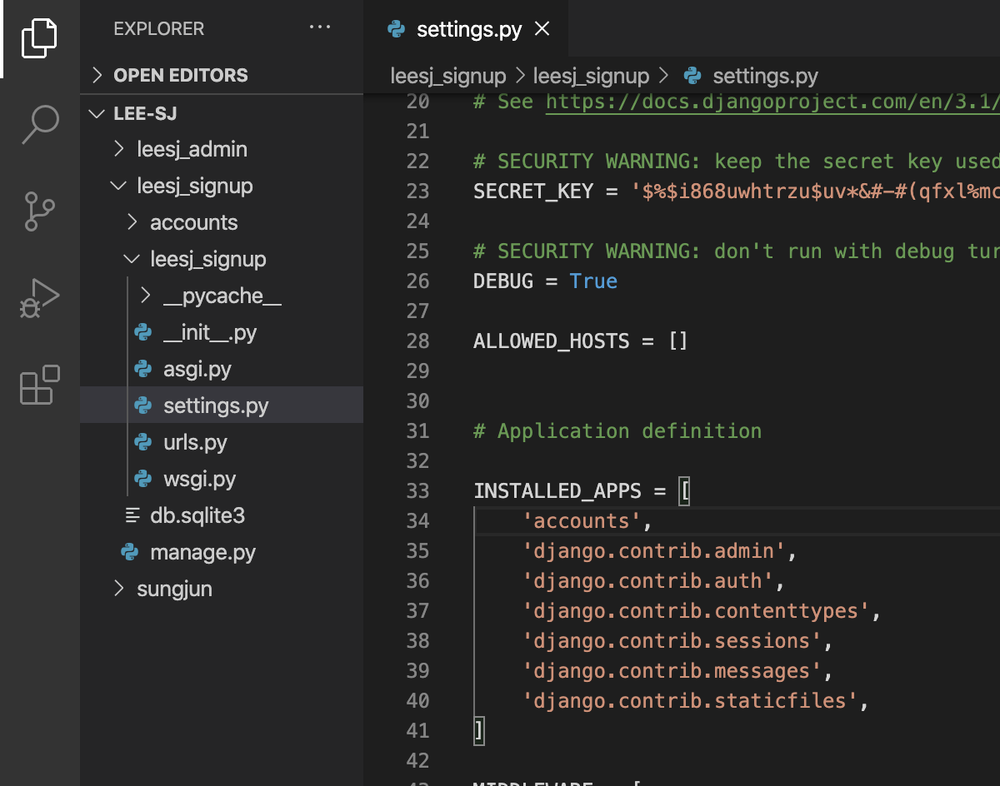  

### 회원가입과 로그인 / 로그아웃 urls 를 설정

``` python
# accounts/urls.py 파일을 만들어주세요
from django.urls import path
from . import views

urlpatterns = [
        path('signup/', views.signup, name='signup'),
        path('login/', views.login, name='login'),
        path('logout/', views.logout, name='logout'),
]
```
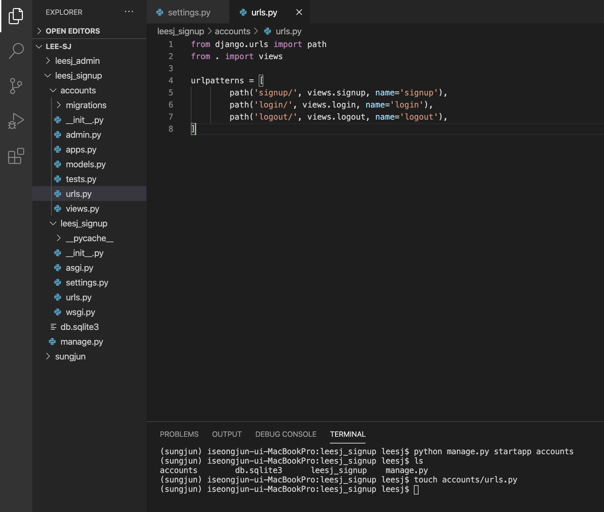  

``` python
# leesj_signup/urls.py 에 해당 코드를 추가해서 앱 내부로 url을 끌어옵니다. 
from django.urls import path, include

urlpatterns = [
		path('admin/', admin.site.urls),
		path('accounts/', include('accounts.urls')),
]
```
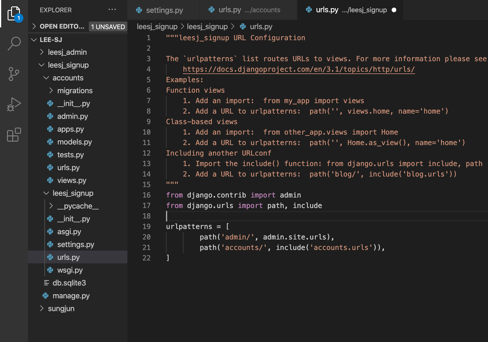  

### 각 url을 작동할 view 파일을 설정

``` python
# accounts/views.py 우선 페이지확인을 위한 뼈대만 만들어둡니다. 
from django.shortcuts import render

def signup(request):
    return render(request, 'signup.html')
    
def login(request):
    return render(request, 'login.html')

def logout(request):
    return render(request, 'logout.html')
```
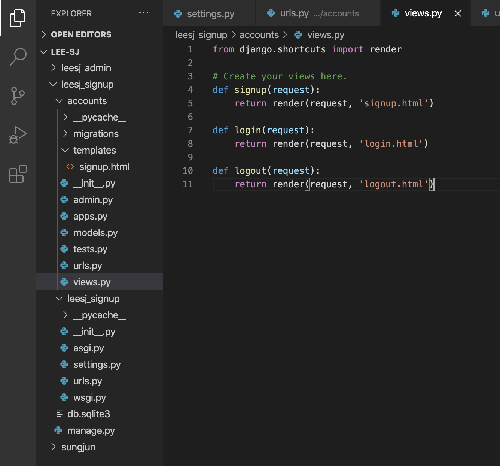  


### 회원가입과 로그인을 해줄 templates 파일들을 만들어줍니다. 

회원가입 템플릿 먼저 만들어주겠습니다. 

``` html
<!-- accounts/templates/signup.html 파일  
 ! + tab 으로 html 뼈대를 만들고, head 안쪽에 bootstrapcdn을 넣어주세요
 그리고 아래 코드를 바디안쪽에 넣어주세요 -->
<div class="container" style="padding-top:100px; ">
    <h1>Sign Up!</h1>
    <form>
        Username:
        <br>
        <input name="username" type="text" value="">
        <br>
        Password:
        <br>
        <input name="password1" type="password" value="">
        <br>
        Confirm Password:
        <br>
        <input name="password2" type="password" value="">
        <br>
        <br>
        <input class="btn btn-primary" type="submit" value="Sign Up!">
    </form>
</div>
```
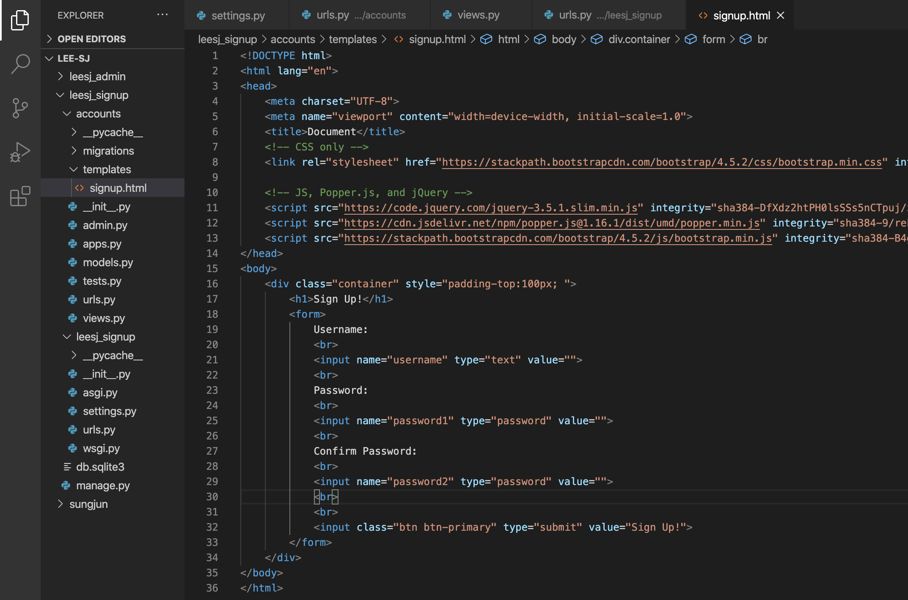  

그리고 나서 서버를 켜고 `python manage.py runserver` 회원가입 url(/accounts/signup)로 접속하면 아래와 같은 화면이 나옵니다.  
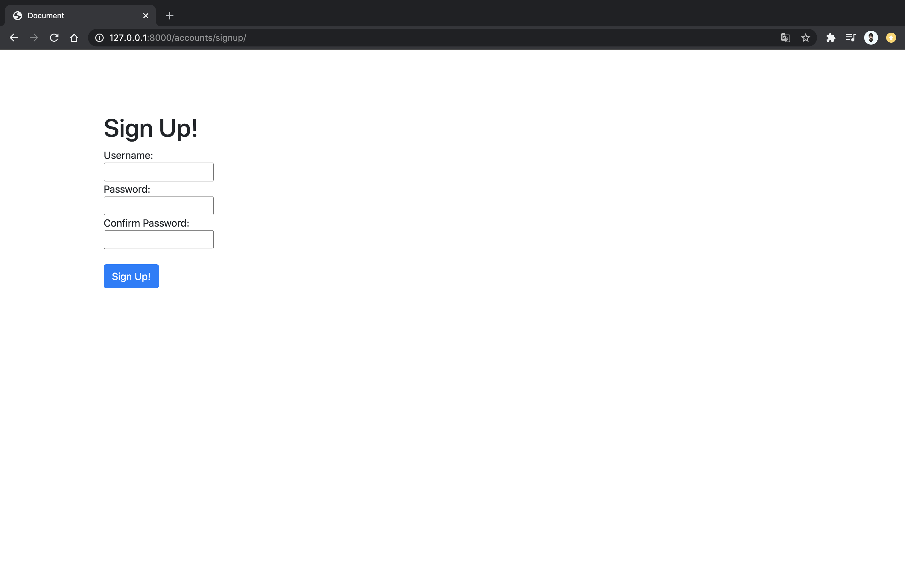  

이어서 로그인 템플릿도 생성하고 url(/accounts/login)를 확인합니다.  

``` html
<!-- 똑같이 html 코드와 bootstrapcdn을 넣고 아래 코드를 바디안에 넣어주세요 -->
    <div class="container" style="padding-top:100px; ">
        <h1>Login</h1>
        <form>
            Username:
            <br>
            <input name="username" type="text" value="">
            <br>
            Password:
            <br>
            <input name="password" type="password" value="">
            <br>
            <br>
            <input class="btn btn-primary" type="submit" value="Login">
        </form>
    </div>
```
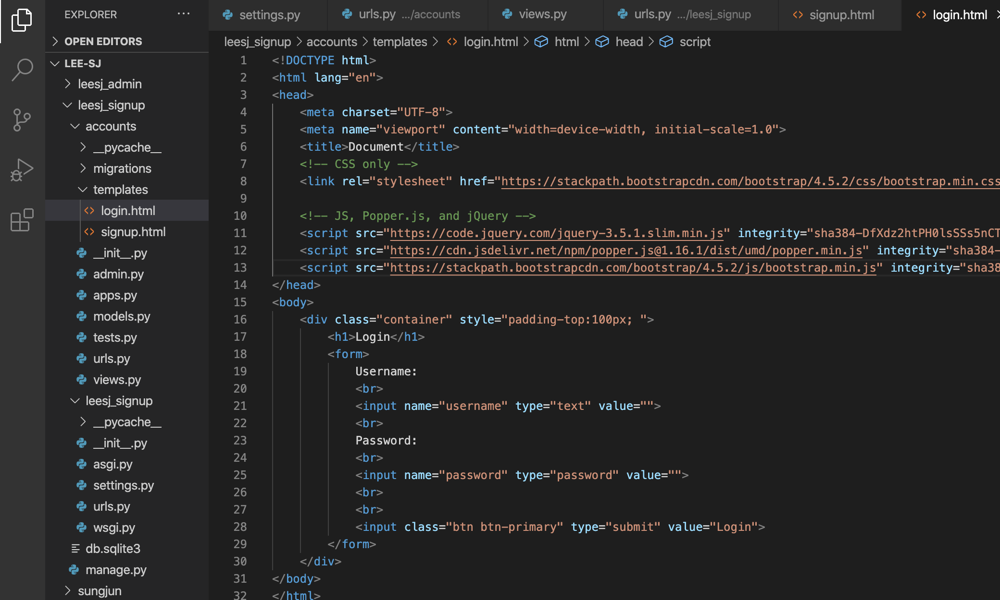  

코드를 작성하고 페이지 확인까지 합니다.  

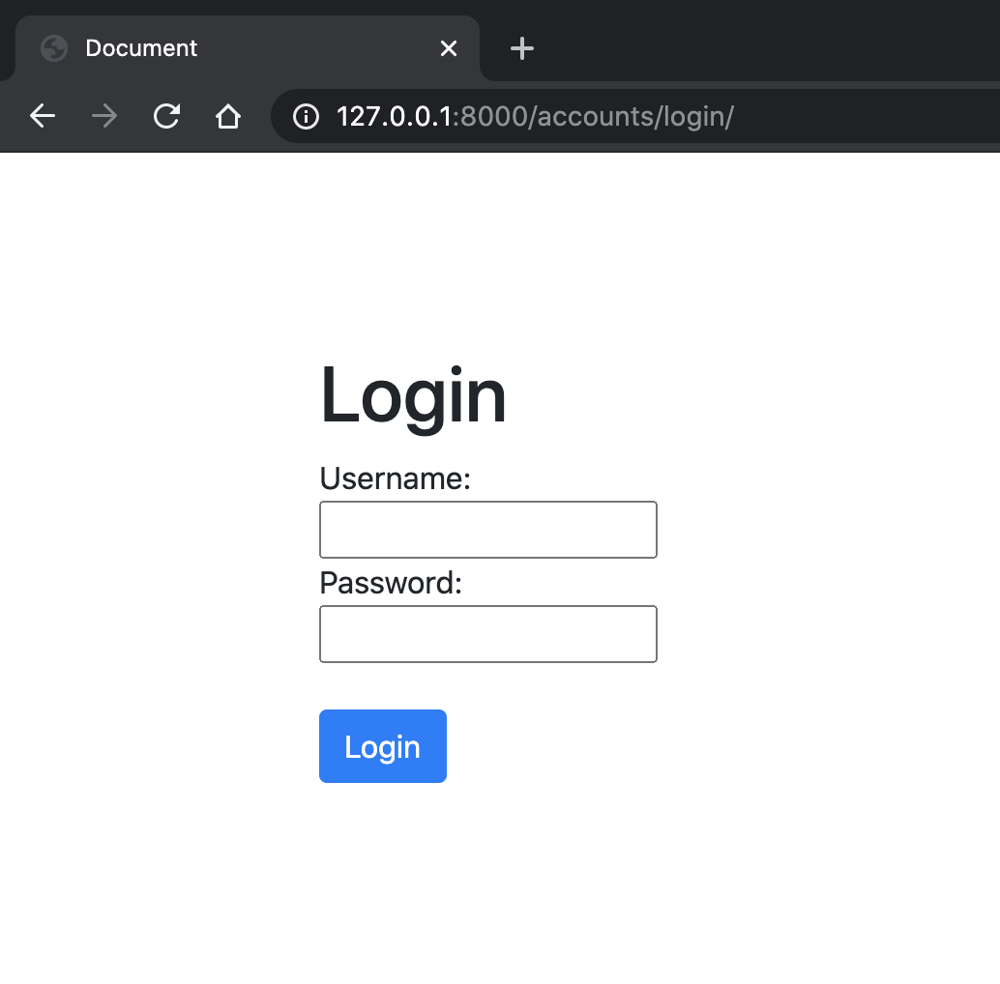

###  accounts app의 root url - 첫화면을 설정

앞에서 해주었어야할 한가지를 빼먹고 왔습니다. accounts app의 root 페이지를 만들지 않았는데요  
해당코드는 직접 작성해보세요  

간단하게 설명하면 첫화면을 연결할 view.py 코드와 templates 파일 그리고 urls.py 코드가 필요합니다.  
저는 간단하게 accounts app의 root url을 만들어보았습니다.  
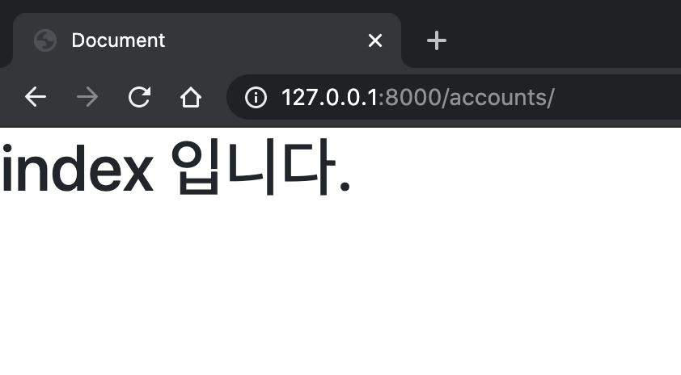

### 이제 index 에 회원가입버튼과 로그인 버튼을 만들어주세요
``` html
    <a class="nav-link" href="">SignUp</a>
    <a class="nav-link" href="">Login</a>
```
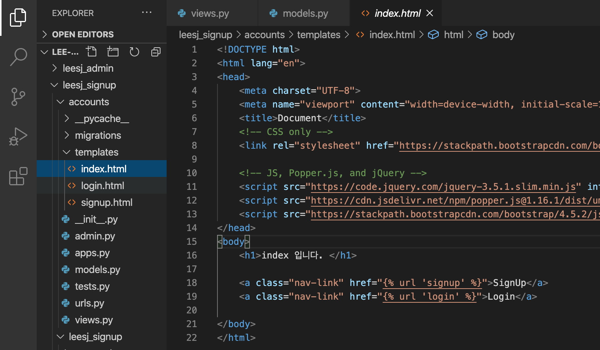  
그리고 본격적으로 기능코드를 작성합니다. 

### signup 템플릿 코드 작성
``` html
<!-- 회원가입 폼을 작성했을때 작동하는 action을 form tag에 명시해줍니다.  
 method는 POST 를 통해서 진행됩니다. 그리고 보안토큰을 추가해줍니다. 
 해당 내용은 이후 추가설명합니다. 
-->
... 중략 ...
    <h1>Sign Up!</h1>
    <form method="POST" action="">
        
        Username:
... 중략 ...
```
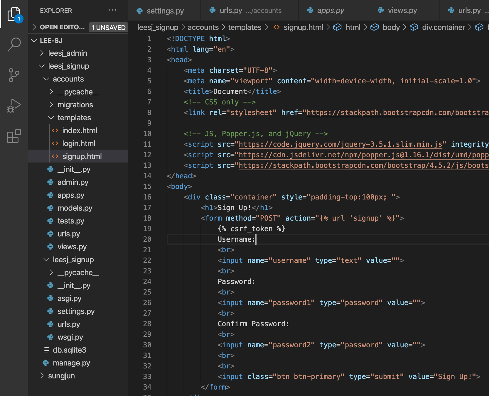  
### signup view 코드 작성
``` python
# accounts/views.py
from django.shortcuts import render,redirect # return값 redircet 추가 
from django.contrib.auth.models import User  # User model 연결 

def signup(request):
    # POST method 요청이 들어올때
    if request.method == 'POST':
        # 입력한 password1과 password2가 만약 같으면
        if request.POST['password1'] == request.POST['password2']:
            # 새로운 회원을 만들고
            User.objects.create_user(request.POST['username'], password=request.POST['password1']) 
        # index로 돌아간다. 
        return redirect('index')  
    # 위의 경우가 아닐때 그냥 signup페이지를 다시 리턴한다. 
    return render(request, 'signup.html')
```
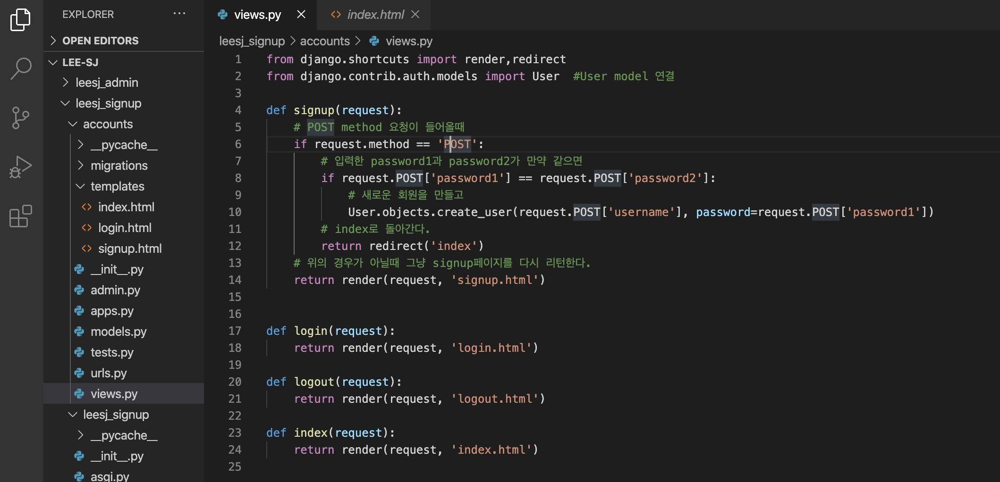  

### model 코드 작성 과 migrate
``` python
# accounts/model.py 
from django.db import models

# Create your models here.
from django.contrib.auth.models import User
```
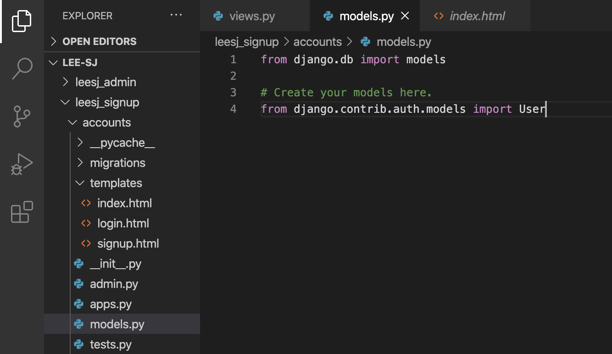  

그리고 User model 을 migrate 해줍니다. 
``` bash
# migrate
(sungjun) $ python manage.py migrate

# runserver
(sungjun) $ pyhotn manage.py runserver
```
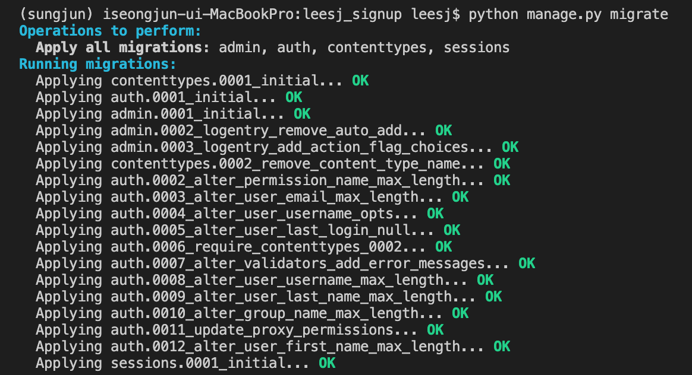  

여기까지 하였다면 버튼으로 /accounts/signup 으로 접속하여서 회원가입을 진행해보세요.  
만약 submit 버튼을 누르고 /accounts 로 이동하며, terminal에 
``` bash
"GET /accounts/signup/ HTTP/1.1" 200 1823 # 이렇게 signup 페이지로 접속한것을 확인하고, 
"POST /accounts/signup/ HTTP/1.1" 302 0   # POST method 로 signup 요청이 있는 것을 확인하고, 
"GET /accounts/ HTTP/1.1" 200 1230        # 바로 /accounts로 이동함을 확인
```
하였다면 정상적으로 작동한것인데요. 이상태에서 우리가 회원가입이 정상적으로 작동한것을 알려면 로그인 기능을 추가로 구현하는것 말고 무엇이 있을까요?  

바로 ...  

...  

admin page!! 입니다. 바로 관리자 계정을 만들어서 들어가봅시다.  

``` bash
(sungjun) $ python manage.py createsuperuser
Username (leave blank to use 'leesj'): leesj
Email address: leesj@likelion.org
Password: 
Password (again): 
Superuser created successfully.
(sungjun) $ python manage.py runserver
```

바로 Users 모델을 확인해보면 이전에 우리가 만들었던 유저 데이터가 저장되어있음을 확인할 수 있습니다.  

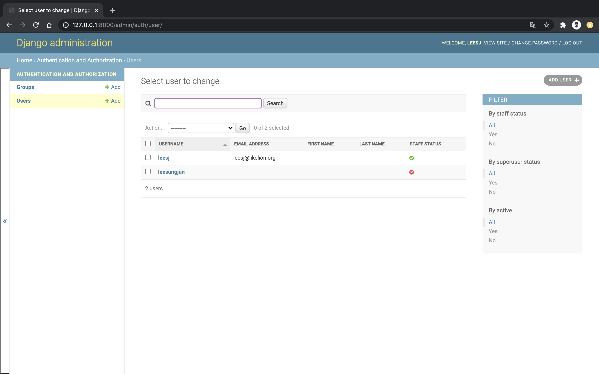

그렇다면, 회원가입 기능 구현 성공 !!

