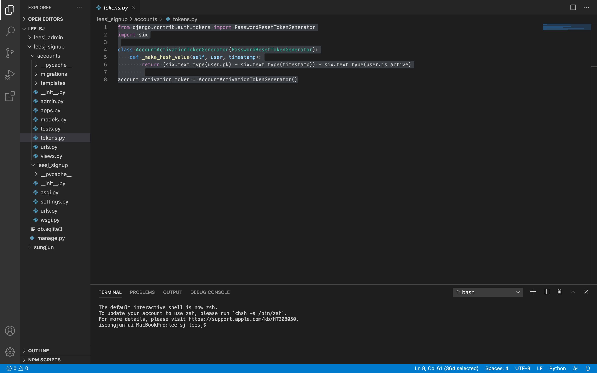

Google mail auth
=

회원 가입을 할때 인증메일을 보내는 이메일 회원가입 인증을 구현해보겠습니다.  
이전의 로그인 회원가입 세션의 프로젝트와 이어지는 세션입니다.  

우선 시작전 여러가지의 메일이나 관련된 유료 서비스를 사용할수도 있고, 여러가지의 방법이 있지만 그중에서 쉽고 빠르게 Gmail 을 통해서 메일인증을 구현하는 방법으로 진행합니다.  

먼저 가상환경을 켜는것을 항상 잊지 말아주세요 
``` bash
$ source sungjun/bin/activate
```

우선 가상환경을 킨 상태에서 Google 과 Gmail 설정부터 해주겠습니다.  
먼저 Gmail 로 접속하고, 오른쪽 위의 설정 (톱니바퀴모양)을 선택해주세요.  
그리고 나오는 설정 화면의 상단부분 '모든 설정 보기'를 선택해주세요
  

그러면 아래와 같은 상세 설정화면이 나옵니다.  
여기에서 상단의 상세 메뉴에서 '전달 및 POP/IMAP'를 선택해주세요 
  

해당 화면에서 가운데 있는 IMAP 엑세스 부분의 선택지를 첫번째인 'IMAP 사용' 로 변경해주세요  
  

그러면 아래와 같이 설정 화면이 변경되고 '변경사항 저장' 버튼이 나오면 해당 버튼을 선택
  

그리고 이어서 구글 계정 설정으로 들어옵니다.  
왼쪽 메뉴에서 '보안'메뉴로 들어갑니다. 
  

보안메뉴에서 아래로 내려보면 '보안 수준이 낮은 앱의 액세스' 설정이 나옵니다. 여기에서 '엑세스 사용 설정(권장하지 않음)을 선택해주세요
  

보안수준이 낮은 앱의 허용 부분을 사용안함에서 아래와 같이 사용으로 바꾸고 해당 설정화면에서 나옵니다. 

  

설정화면에서 나왔을때 이렇게 바뀌었다면 Google 에서 설정해줄 것을 끝입니다.  
다시 프로젝트로 돌아옵니다.  

  

가장 먼저 settings.py 에서 메일 설정을 추가합니다. 
``` python
#Email을 발송할 주체에 대한 설정입니다
EMAIL_HOST = 'smtp.gmail.com'

#Gmail을 사용하기 위한 Port 번호입니다
EMAIL_PORT = '587'

#여기에 여러분의 Gmail 계정을 적어주세요 (* 별이 아닌 실제 메일 계정을 작성합니다. )
EMAIL_HOST_USER = '**********@gmail.com'

#여기에 여러분의 Gmail 계정에 대한 비밀번호를 적어주세요 (* 별이 아닌 본인메일의 실제 비밀번호를 입력합니다. )
EMAIL_HOST_PASSWORD = '****************'

#TLS 사용을 허가합니다. 무슨 뜻일까요?
EMAIL_USE_TLS = True

#회신에 대한 기본 설정입니다.
DEFAULT_FROM_EMAIL = EMAIL_HOST_USER
```
( 사진과 코드는 예시이고 이후 실제 메일과 비번으로 바꾸어서 저장하였습니다. )  
  

views.py 에서 모듈을 추가로 import 하고, sign_up 부분을 수정합니다. 
``` python
from django.contrib.sites.shortcuts import get_current_site
from django.template.loader import render_to_string
from django.utils.http import urlsafe_base64_encode,urlsafe_base64_decode
from django.core.mail import EmailMessage
from django.utils.encoding import force_bytes, force_text
from .tokens import account_activation_token
 
def signup(request):
    if request.method == "POST":
        if request.POST["password1"] == request.POST["password2"]:
            user = User.objects.create_user(request.POST["username"], request.POST["email"], request.POST["password1"])
            user.is_active = False
            user.save()
            current_site = get_current_site(request) 
            message = render_to_string('activation_email.html', {
                'user': user,
                'domain': current_site.domain,
                'uid': urlsafe_base64_encode(force_bytes(user.pk)),
                'token': account_activation_token.make_token(user),
            })
            mail_title = "계정 활성화 확인 이메일"
            mail_to = request.POST["email"]
            email = EmailMessage(mail_title, message, to=[mail_to])
            email.send()
            return render(request, 'index.html', { 'error': 'Please check your account activation email'})
    return render(request, 'signup.html')
```
  

그리고 activate 함수를 추가해줍니다. 
``` python
def activate(request, uidb64, token):
    try:
        uid = force_text(urlsafe_base64_decode(uidb64))
        user = User.objects.get(pk=uid)
    except(TypeError, ValueError, OverflowError, User.DoesNotExsit):
        user = None
    if user is not None and account_activation_token.check_token(user, token):
        user.is_active = True
        user.save()
        auth.login(request, user)
        return render(request, 'index.html', { 'error': 'Your Accounts is activate'})
    else:
        return render(request, 'index.html', { 'error': '계정 활성화 오류'})
    return 
```
  

그리고 accounts 앱에 tokens.py 를 추가하여서 아래의 코드를 입력해주세요.  

``` python
from django.contrib.auth.tokens import PasswordResetTokenGenerator
import six

class AccountActivationTokenGenerator(PasswordResetTokenGenerator):
    def _make_hash_value(self, user, timestamp):
        return (six.text_type(user.pk) + six.text_type(timestamp)) + six.text_type(user.is_active)
        
account_activation_token = AccountActivationTokenGenerator()
```
  

여기서 sign_up 부분에서 수정된 부분에서 이메일을 회원가입에서 받는것으로 수정되었습니다.  
회원가입 템플릿을 수정하여서 이메일을 추가해주세요.  


그리고 인증메일로 발송할 템플릿을 작성해줍니다.  
activation_email.html 템플릿을 만들었고 아래의 내용을 채웠습니다.  
( 두번째 줄만 필수이고 다른줄은 추가 수정하여도 무방합니다. )
``` html
{{user.username}}님, 아래 링크를 클릭하여 계정을 활성화하세요:
http://{{domain}}
```

이후 해당 템플릿에서 사용할 url 을 생성해주어야 합니다. 
urls.py 로 이동하여서 path 를 한개 추가합니다. 
``` python
path('activate/<str:uidb64>/<str:token>/', views.activate, name="activate"),
```

이전의 관리자 계정이 생각난다면 그대로 사용해도 되고 이전의 관리자 계정을 잊었다면 새로 만들고 runserver 로 시작합니다. 

``` bash
(sungjun) $ python manage.py creatsuperuser

(sungjun) $ python manage.py runserver
```

먼저 어드민으로 접속하여서 이전에 테스트 하면서 생성하였던 계정들을 삭제하고 어드민만 남겨두겠습니다. 
(이전에 제가 사용하던 실제 이메일을 사용했습니다. )  
유저 삭제는 유저의 체크박스를 선택하고 action 에서 유저 삭제를 선택하고 go 를 누르면 삭제를 진행합니다. 
  

이렇게 해둔 상태에서 다른 사용자 브라우저를 열거나 시크릿 창을 열어서 회원가입을 진행합니다.  
   

회원가입을 진행하고 어드민 페이지에서 해당 유저의 테이블을 확인하면 activate 가 활성화되어있지 않은것을 확인할 수 있습니다.  
이상태라면 회원가입은 되었지만 미인증인 상태로 로그인을 시도한다면 로그인이 되지 않습니다.  
  


이렇게 메일을 확인하라는 메시지와 함께 정상적으로 진행되었다면 다음으로 본인이 작성한 메일로 들어가서 인증메일을 확인합니다. 
  


이와 같은 확인메일이 와 있습니다. ( 스팸메일까지 확인해주세요. )  
링크를 눌러서 회원가입을 진행해주세요.  
  

그럴경우 이런 화면이 나옴과 함께 회원가입이 완료됩니다. 
  

그리고 다시 유저테이블을 확인하면 activate 된것을 확인할 수 있습니다. 
  


